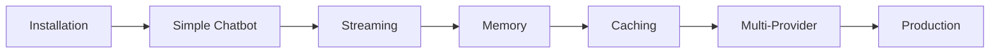

# Tutorial Introduction

Welcome to the RapidAI tutorial! 🚀

This tutorial will guide you through building increasingly sophisticated AI applications, from a simple chatbot to a production-ready system with RAG, caching, and deployment.

## What You'll Build

By the end of this tutorial, you'll have built:

1. **Simple Chatbot** - Basic streaming chat endpoint
2. **Stateful Assistant** - Conversation memory and context
3. **Document Q&A System** - RAG-powered knowledge base
4. **Production API** - Complete with caching, monitoring, and deployment

## Prerequisites

!!! info "Before You Start"
    - Python 3.9 or higher installed
    - Basic Python knowledge (functions, async/await)
    - API key for Anthropic or OpenAI
    - 30-60 minutes of time

## Tutorial Structure

### Part 1: Basics

- [Simple Chatbot](simple-chatbot.md) - Your first AI endpoint
- [Streaming Responses](streaming.md) - Real-time output
- [Conversation Memory](memory.md) - Stateful conversations

### Part 2: Advanced Features

- [Caching](caching.md) - Save money and time
- [Multiple Providers](multi-provider.md) - Provider flexibility
- [Error Handling](error-handling.md) - Production readiness

### Part 3: Production

- Configuration Management
- Testing Your App
- Performance Optimization
- Deployment Strategies

## Learning Path

## Tutorial Conventions

Throughout this tutorial:

!!! tip "Tips"
    Helpful hints and best practices

!!! warning "Warnings"
    Common pitfalls to avoid

!!! info "Information"
    Additional context and explanations

!!! success "Success"
    Milestones and achievements

## Code Examples

All code examples are:

- ✅ **Tested** - Every example works out of the box
- ✅ **Complete** - No missing imports or setup
- ✅ **Progressive** - Each builds on the previous
- ✅ **Practical** - Real-world use cases

## Getting Help

Stuck? Here's how to get help:

1. **Check the docs** - Search the reference documentation
2. **GitHub Issues** - [Report bugs or ask questions](https://github.com/shaungehring/rapidai/issues)
3. **Discussions** - [Community Q&A](https://github.com/shaungehring/rapidai/discussions)
4. **Discord** - Join our community (coming soon)

## Ready to Start?

Let's build your first AI application!

  <a href="simple-chatbot/" class="md-button md-button--primary" style="font-size: 1.2rem;">Start with Simple Chatbot →</a>

---

!!! quote "Remember"
    Every expert was once a beginner. Take your time, experiment, and have fun! 🎉
